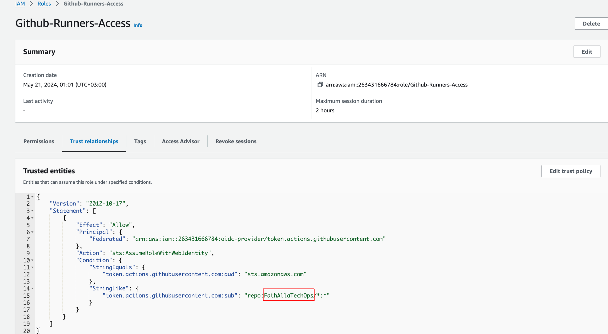

# github-oidc-role-setup

# AWS IAM to OIDC Migration Guide

This repository provides a comprehensive guide for migrating from AWS IAM user credentials to OpenID Connect (OIDC) roles for use in GitHub Actions CI/CD workflows. The repository includes an Ansible playbook that automates the setup of AWS Identity Provider and the configuration of IAM roles with the necessary trust policy for secure and efficient OIDC integration.

## Prerequisites

Before you begin, ensure you have the following installed:

1. [AWS CLI](https://aws.amazon.com/cli/)
2. [Ansible](https://docs.ansible.com/ansible/latest/installation_guide/intro_installation.html)

## Steps

1. Clone the repository and navigate into it:
    ```bash
    git clone https://github.com/engFathalla/github-oidc-role-setup.git
    cd github-oidc-role-setup
    ```

2. Adjust the "Trust relationships" in the Ansible playbook for your personal GitHub or your organization:
    ```json
    {
      "Version": "2012-10-17",
      "Statement": [
        {
          "Effect": "Allow",
          "Principal": {
            "Federated": "arn:aws:iam::{{ aws_account_id }}:oidc-provider/token.actions.githubusercontent.com"
          },
          "Action": "sts:AssumeRoleWithWebIdentity",
          "Condition": {
            "StringEquals": {
              "token.actions.githubusercontent.com:aud": "sts.amazonaws.com"
            },
            "StringLike": {
              "token.actions.githubusercontent.com:sub": "repo:<GitHub_(User/Organization)_Name>/*:*"
            }
          }
        }
      ]
    }
    ```

3. Authenticate with AWS using one of the following methods:
    - Using `aws configure`:
      ```bash
      aws configure
      ```
    - Using environment variables:
      ```bash
      export AWS_ACCESS_KEY_ID=<your-access-key-id>
      export AWS_SECRET_ACCESS_KEY=<your-secret-access-key>
      export AWS_DEFAULT_REGION=<your-default-region>
      ```
    - Using a named AWS profile:
      ```bash
      export AWS_PROFILE=<your-aws-profile>
      ```

    Ensure that you have the necessary permissions to create Identity Providers, Roles, and attach policies.

4. Run the Ansible playbook:
    ```bash
    ansible-playbook github-runners-access.yaml
    ```

5. Validate the setup from the AWS console. Check the IAM Role and its Trust relationships to ensure it has been configured correctly.
    - 


## License

This project is licensed under the MIT License. See the [LICENSE](LICENSE) file for details.

